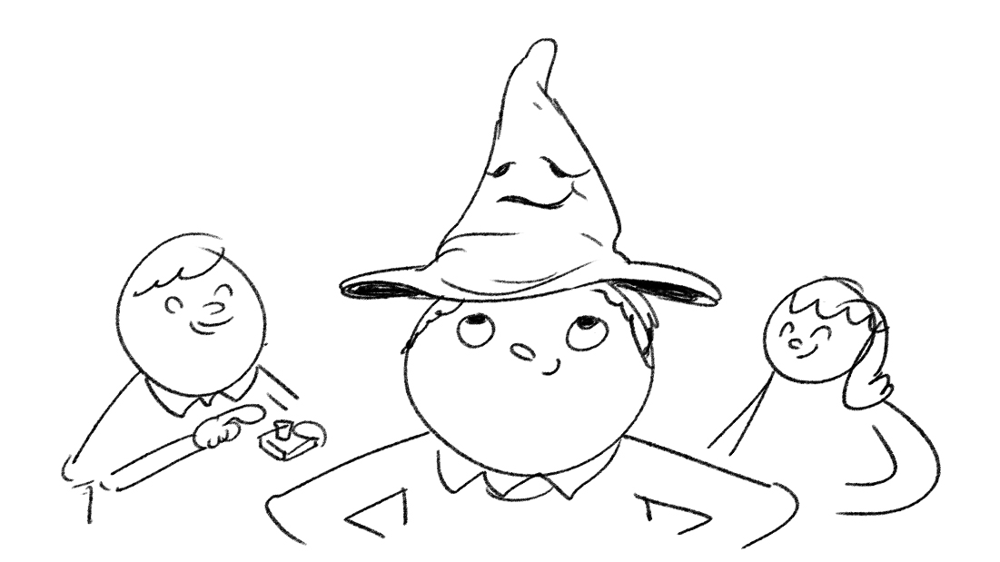

**This is an archived resource.** The repo will remain available but the resource will no longer be maintained or updated. Some or all parts of the resource may no longer work. To see our latest resources, please visit [raspberrypi.org](http://www.raspberrypi.org).

# Raspberry Pi Sorting Hat

Sorting children into houses can be time-consuming, but with magic Hogwarts were able to sort their yearly intake into houses really easily. Let's replace the magic with some code to achieve the same result!

In this lesson, students will create a Raspberry Pi-powered Harry Potter-style Sorting Hat, using the button on a Pibrella add-on board.

It is assumed that students have prior knowledge of the programming concepts of loops, conditionals and functions in Python. Alternatively, the lesson can also be completed using Scratch.

## Students will learn

- How to create a random group generator based on the Harry Potter Sorting Hat.
- How to use functions, variables, randomisation, conditionals, and loops.

## Computing program of study met

KS2:

- Design, write and debug programs that accomplish specific goals; solve problems by breaking them into smaller parts.
- Select, use and combine a variety of software on a range of digital devices to design and create a range of programs.
- Use sequence, selection and repetition in programs; work with variables and various forms of input and output.
- Use logical reasoning to explain how some simple algorithms work; detect and correct errors in algorithms and programs.

KS3:

- Use two or more programming languages, at least one of which is textual, to solve a variety of computational problems.

## Resources

For the majority of the lesson, it is suggested that work is carried out by students on a Raspberry Pi in pairs or a small group. Each pair or group should have access to the standard equipment described below:

- A Raspberry Pi
- The latest NOOBS SD card with Raspbian installed
- A keyboard and mouse connected to the Raspberry Pi
- A monitor connected to the Raspberry Pi
- A [Pibrella](http://pibrella.com)
- 1 x speakers or headphones
- Hat

## Lesson Plan

- [Lesson 1: Raspberry Pi Sorting Hat](lesson-1/lesson.md)

## Licence

Unless otherwise specified, everything in this repository is covered by the following licence:

***Sorting Hat Lesson*** by Raspberry Pi Certified Educator [Simon Johnson](http://teachwithict.weebly.com/harry-potter-sorting-hat.html#sthash.NmynO2x0.kkvB3WUr.dpuf) and the [Raspberry Pi Foundation](http://raspberrypi.org) is licenced under a [Creative Commons Attribution 4.0 International License](http://creativecommons.org/licenses/by-sa/4.0/).

Based on a work at https://github.com/raspberrypilearning/sorting-hat-lesson & http://teachwithict.weebly.com/harry-potter-sorting-hat.html
